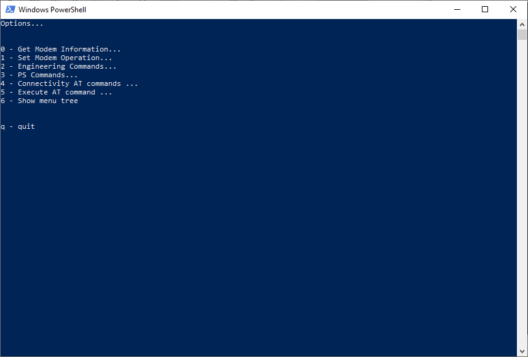
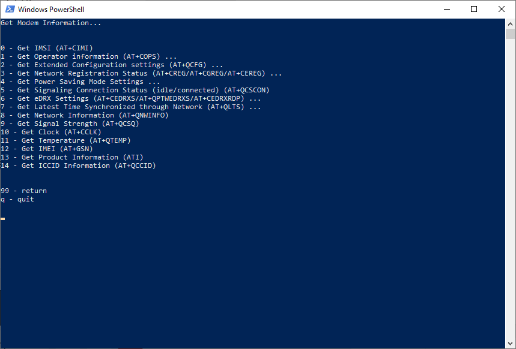
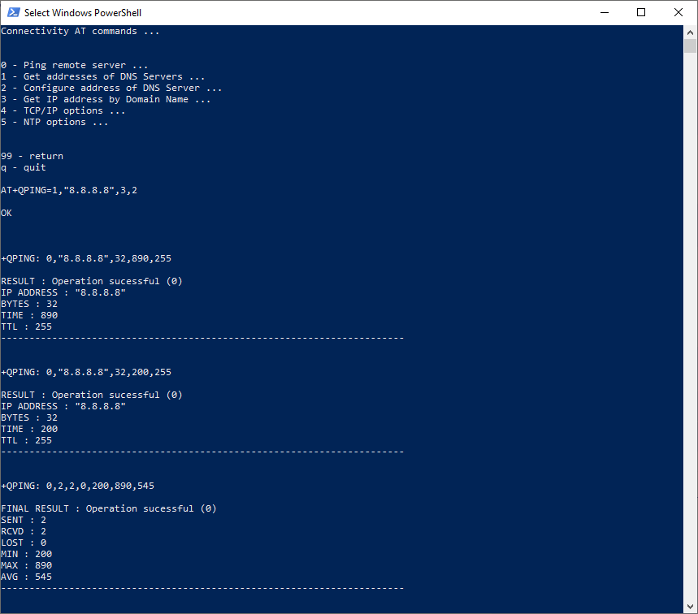
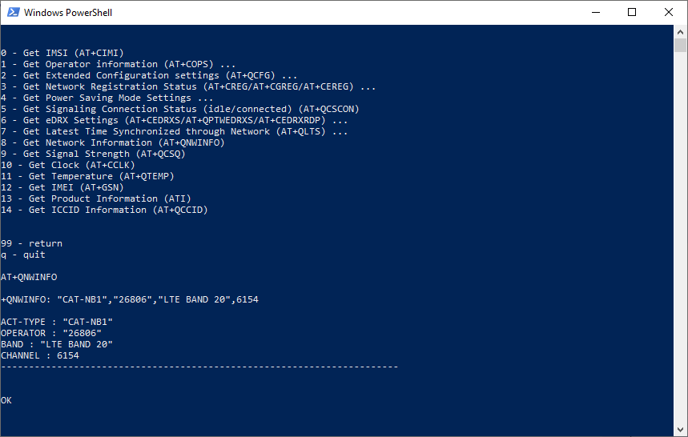

# IoT Quectel BG96 AT Command tool

This is a CLI menu application to configure and operate a Quectel BG96 IoT module.
Some AT commands are standard, so they should work with other modems.
Even proprietary Quectel AT commands should also work with other Quectel modules.

The driver to develop this application was for PSM and eDRX configuration of the module.
During the development a lot of other operations on the module were added, mainly connectivity options using ping or tcp/udp sockets.

The application has two threads:

- The input thread (that reads user choices and options)
- The read thread (that reads modem outputs, display's them, and tries to parse it in case the AT command belongs to the list of commands to decode)

This application is written in python3 and the only non standard module neeeded is the pyserial module (pip3 install pyserial).
If you already use the QCSuper tool, this module should already be installed.

These are the implemented options:

```
Options...
     0 - Get Modem Information...
       0.0 - Get IMSI (AT+CIMI)
       0.1 - Get Operator information (AT+COPS) ...
         0.1.0 - Get current Operator (AT+COPS?)
         0.1.1 - Get all available Operators (AT+COPS=?) (may take time)
       0.2 - Get Extended Configuration settings (AT+QCFG) ...
         0.2.0 - RATs to be Searched
         0.2.1 - RAT Searching Sequence
         0.2.2 - Network Category to be searched under LTE RAT (IOT Mode)
         0.2.3 - Roam Service
         0.2.4 - Band Configuration
         0.2.5 - LTE Cat NB1 Coverage Enhancement Level
         0.2.6 - Service Domain Configuration
         0.2.7 - Band Scan Priority under LTE Cat NB1
         0.2.8 - PSM Entering Indication
         0.2.9 - UE SGSN Release Version Configuration
         0.2.10 - UE MSC Release Version Configuration
         0.2.11 - Establish Multi PDNs with the same APN
         0.2.12 - NETLIGHT output mode
         0.2.13 - IMS Function Control
         0.2.14 - RI Behavior when RING URC is Presented
         0.2.15 - RI Behavior when Incoming SMS URCs are Presented
         0.2.16 - RI Behavior when Other URCs are Presented
         0.2.17 - RI Signal Output Carrier
         0.2.18 - Delay URC Indication
         0.2.19 - URC Output Port for CMXU
         0.2.20 - AP_READY PIN
         0.2.21 - Trigger Module into PSM Immediately
         0.2.22 - Abort RRC Connection
         0.2.23 - Configured Features of NB-IoT
       0.3 - Get Network Registration Status (AT+CREG/AT+CGREG/AT+CEREG) ...
         0.3.0 - Get Network Registration Status (AT+CREG)
         0.3.1 - Get Network Registration Status (AT+CGREG)
         0.3.2 - Get EPS Network Registration Status (AT+CEREG)
       0.4 - Get Power Saving Mode Settings ...
         0.4.0 - Get Power Saving Mode Settings (AT+CPSMS)
         0.4.1 - Get Power Saving Mode Modem Optimization (AT+QPSMEXTCFG)
       0.5 - Get Signaling Connection Status (idle/connected) (AT+QCSCON)
       0.6 - Get eDRX Settings (AT+CEDRXS/AT+QPTWEDRXS/AT+CEDRXRDP) ...
         0.6.0 - Get e-I-DRX Settings (AT+CEDRXS)
         0.6.1 - Get eDRX / ptw Settings (AT+QPTWEDRXS)
         0.6.2 - Get e-I-DRX Dynamic Settings (AT+CEDRXRDP)
       0.7 - Get Latest Time Synchronized through Network (AT+QLTS) ...
         0.7.0 - Latest time that has been synchronized
         0.7.1 - Current GMT time calculated from the latest time synch
         0.7.2 - Current LOCAL time calculated from the latest time synch
       0.8 - Get Network Information (AT+QNWINFO)
       0.9 - Get Signal Strength (AT+QCSQ)
       0.10 - Get Clock (AT+CCLK)
       0.11 - Get Temperature (AT+QTEMP)
       0.12 - Get IMEI (AT+GSN)
       0.13 - Get Product Information (ATI)
       0.14 - Get ICCID Information (AT+QCCID)
     1 - Set Modem Operation...
       1.0 - RAT Search sequence...
         1.0.0 - Automatic
         1.0.1 - GSM -> LTE-M -> LTE NB-IoT
         1.0.2 - GSM -> LTE NB-IoT -> LTE-M
         1.0.3 - LTE-M -> GSM -> LTE NB-IoT
         1.0.4 - LTE-M -> LTE NB-IoT -> GSM
         1.0.5 - LTE NB-IoT -> GSM -> LTE-M
         1.0.6 - LTE NB-IoT -> LTE-M -> GSM
       1.1 - RATs to be searched...
         1.1.0 - Automatic
         1.1.1 - GSM Only
         1.1.2 - LTE Only
       1.2 - RATs to be searched under LTE RAT...
         1.2.0 - LTE-M
         1.2.1 - LTE NB-IoT
         1.2.2 - LTE-M and LTE NB-IoT
       1.3 - Band...
         1.3.0 - GSM...
           1.3.0.0 - Only GSM 900MHz
           1.3.0.1 - Only GSM 1800MHz
           1.3.0.2 - Only GSM 850MHz
           1.3.0.3 - Only GSM 1900MHz
           1.3.0.4 - Any Frequency band
         1.3.1 - LTE-M...
           1.3.1.0 - Only LTE B1
           1.3.1.1 - Only LTE B2
           1.3.1.2 - Only LTE B3
           1.3.1.3 - Only LTE B4
           1.3.1.4 - Only LTE B5
           1.3.1.5 - Only LTE B8
           1.3.1.6 - Only LTE B12
           1.3.1.7 - Only LTE B13
           1.3.1.8 - Only LTE B18
           1.3.1.9 - Only LTE B19
           1.3.1.10 - Only LTE B20
           1.3.1.11 - Only LTE B26
           1.3.1.12 - Only LTE B28
           1.3.1.13 - Only LTE B39
           1.3.1.14 - Only Any Frequency band
           1.3.1.15 - Choose multiple Frequency bands
         1.3.2 - LTE NB-IoT...
           1.3.2.0 - Only LTE B1
           1.3.2.1 - Only LTE B2
           1.3.2.2 - Only LTE B3
           1.3.2.3 - Only LTE B4
           1.3.2.4 - Only LTE B5
           1.3.2.5 - Only LTE B8
           1.3.2.6 - Only LTE B12
           1.3.2.7 - Only LTE B13
           1.3.2.8 - Only LTE B18
           1.3.2.9 - Only LTE B19
           1.3.2.10 - Only LTE B20
           1.3.2.11 - Only LTE B26
           1.3.2.12 - Only LTE B28
           1.3.2.13 - Any Frequency band
           1.3.2.14 - Choose multiple Frequency bands
       1.4 - Service Domain...
         1.4.0 - PS Only
         1.4.1 - CS & PS
       1.5 - Enable/Disable PSM Entering Indication...
         1.5.0 - Disable
         1.5.1 - Enable
       1.6 - Configure Features of NB-IoT...
         1.6.0 - Reset bits
         1.6.1 - Enable EMM_CP_CIOT
         1.6.2 - Enable EMM_UP_CIOT
         1.6.3 - Enable EMM_S1_U
         1.6.4 - Enable EMM_ER_WITHOUT_PDN
         1.6.5 - Enable EMM_HC_CP_CIOT
         1.6.6 - Enable EMM_SMS_ONLY
         1.6.7 - Enable EMM_PNB_CP_CIOT
         1.6.8 - Enable EMM_PNB_UP_CIOT
         1.6.9 - Enable EMM_EPCO_CIOT
         1.6.10 - Update value in Modem (needed to activate changes)
         1.6.11 - Show current NB-IoT Features application value
       1.7 - Set Modem functionality (CFUN)...
         1.7.0 - Disable (AT+CFUN=0)
         1.7.1 - Enable (AT+CFUN=1)
         1.7.2 - Disable the ME from both transmitting and receiving (AT+CFUN=4)
         1.7.3 - Enable and Reset the ME (AT+CFUN=1,1). Connection with modem will be lost!
       1.8 - Set Result Codes...
         1.8.0 - Disable result codes (AT+CMEE=0)
         1.8.1 - Enable result codes and numeric values (AT+CMEE=1)
         1.8.2 - Enable result code and verbose values (AT+CMEE=2)
       1.9 - Set PSM Timers...
         1.9.0 - Reset timer values
         1.9.1 - Set Periodic RAU...
           1.9.1.0 - Increments in multiples of 10 minutes
           1.9.1.1 - Increments in multiples of 1 hour
           1.9.1.2 - Increments in multiples of 10 hours
           1.9.1.3 - Increments in multiples of 2 seconds
           1.9.1.4 - Increments in multiples of 30 seconds
           1.9.1.5 - Increments in multiples of 1 minute
         1.9.2 - Set GPRS Ready Timer...
           1.9.2.0 - Increments in multiples of 2 seconds
           1.9.2.1 - Increments in multiples of 1 minute
           1.9.2.2 - Increments in multiples of 6 minutes
           1.9.2.3 - deactivated
         1.9.3 - Set Periodic TAU...
           1.9.3.0 - Increments in multiples of 10 minutes
           1.9.3.1 - Increments in multiples of 1 hour
           1.9.3.2 - Increments in multiples of 10 hours
           1.9.3.3 - Increments in multiples of 2 seconds
           1.9.3.4 - Increments in multiples of 30 seconds
           1.9.3.5 - Increments in multiples of 1 minute
         1.9.4 - Set Active Timer...
           1.9.4.0 - Increments in multiples of 2 seconds
           1.9.4.1 - Increments in multiples of 1 minute
           1.9.4.2 - Increments in multiples of 6 minutes
           1.9.4.3 - deactivated
         1.9.5 - Enable PSM and update value in Modem (needed to activate changes)
         1.9.6 - Disable PSM and update value in Modem (needed to activate changes)
         1.9.7 - Show current PSM application values
       1.10 - Set eDRX Timers...
         1.10.0 - Set eDRX timers with AT+CEDRXS (only TeDRX)...
           1.10.0.0 - Set eDRX for GSM...
             1.10.0.0.0 - Disable the use of e-I-DRX
             1.10.0.0.1 - Enable the use of e-I-DRX
             1.10.0.0.2 - Enable the use of e-I-DRX and enable the unsolicited result code
             1.10.0.0.3 - Disable the use of e-I-DRX and discard/reset all parameters doe e-I-DRX
             1.10.0.0.4 - Define eDRX Timer for GSM...
               1.10.0.0.4.0 - 1.88 seconds
               1.10.0.0.4.1 - 3.76 seconds
               1.10.0.0.4.2 - 7.53 seconds
               1.10.0.0.4.3 - 12.24 seconds
               1.10.0.0.4.4 - 24.48 seconds
               1.10.0.0.4.5 - 48.96 seconds
               1.10.0.0.4.6 - 97.96 seconds
               1.10.0.0.4.7 - 195.84 seconds
               1.10.0.0.4.8 - 391.68 seconds
               1.10.0.0.4.9 - 783.36 seconds
               1.10.0.0.4.10 - 1566.72 seconds
               1.10.0.0.4.11 - 3133.44 seconds
               1.10.0.0.4.12 - Same as 0000 (1.88 seconds)
               1.10.0.0.4.13 - Same as 0000 (1.88 seconds)
               1.10.0.0.4.14 - Same as 0000 (1.88 seconds)
               1.10.0.0.4.15 - Same as 0000 (1.88 seconds)
           1.10.0.1 - Set eDRX for UTRAN...
             1.10.0.1.0 - Disable the use of e-I-DRX
             1.10.0.1.1 - Enable the use of e-I-DRX
             1.10.0.1.2 - Enable the use of e-I-DRX and enable the unsolicited result code
             1.10.0.1.3 - Disable the use of e-I-DRX and discard/reset all parameters doe e-I-DRX
             1.10.0.1.4 - Define eDRX Timer for UTRAN...
               1.10.0.1.4.0 - 10.24 seconds
               1.10.0.1.4.1 - 20.48 seconds
               1.10.0.1.4.2 - 40.96 seconds
               1.10.0.1.4.3 - 81.92 seconds
               1.10.0.1.4.4 - 163.84 seconds
               1.10.0.1.4.5 - 327.68 seconds
               1.10.0.1.4.6 - 655.36 seconds
               1.10.0.1.4.7 - 1310.72 seconds
               1.10.0.1.4.8 - 1966.08 seconds
               1.10.0.1.4.9 - 2621.44 seconds
               1.10.0.1.4.10 - Same as 0000 (10.24 seconds)
               1.10.0.1.4.11 - Same as 0000 (10.24 seconds)
               1.10.0.1.4.12 - Same as 0000 (10.24 seconds)
               1.10.0.1.4.13 - Same as 0000 (10.24 seconds)
               1.10.0.1.4.14 - Same as 0000 (10.24 seconds)
               1.10.0.1.4.15 - Same as 0000 (10.24 seconds)
           1.10.0.2 - Set eDRX for LTE-M...
             1.10.0.2.0 - Disable the use of e-I-DRX
             1.10.0.2.1 - Enable the use of e-I-DRX
             1.10.0.2.2 - Enable the use of e-I-DRX and enable the unsolicited result code
             1.10.0.2.3 - Disable the use of e-I-DRX and discard/reset all parameters doe e-I-DRX
             1.10.0.2.4 - Define eDRX Timer for LTE-M...
               1.10.0.2.4.0 - 5.12 seconds
               1.10.0.2.4.1 - 10.24 seconds
               1.10.0.2.4.2 - 20.48 seconds
               1.10.0.2.4.3 - 40.96 seconds
               1.10.0.2.4.4 - 61.44 seconds
               1.10.0.2.4.5 - 81.92 seconds
               1.10.0.2.4.6 - 102.4 seconds
               1.10.0.2.4.7 - 122.88 seconds
               1.10.0.2.4.8 - 143.36 seconds
               1.10.0.2.4.9 - 163.84 seconds
               1.10.0.2.4.10 - 327.68 seconds
               1.10.0.2.4.11 - 655.36 seconds
               1.10.0.2.4.12 - 1310.72 seconds
               1.10.0.2.4.13 - 2621.44 seconds
               1.10.0.2.4.14 - 5242.88 seconds
               1.10.0.2.4.15 - 10485.76 seconds
           1.10.0.3 - Set eDRX for NB-IoT...
             1.10.0.3.0 - Disable the use of e-I-DRX
             1.10.0.3.1 - Enable the use of e-I-DRX
             1.10.0.3.2 - Enable the use of e-I-DRX and enable the unsolicited result code
             1.10.0.3.3 - Disable the use of e-I-DRX and discard/reset all parameters doe e-I-DRX
             1.10.0.3.4 - Define eDRX Timer for NB-IoT...
               1.10.0.3.4.0 - 5.12 seconds
               1.10.0.3.4.1 - 10.24 seconds
               1.10.0.3.4.2 - 20.48 seconds
               1.10.0.3.4.3 - 40.96 seconds
               1.10.0.3.4.4 - 61.44 seconds
               1.10.0.3.4.5 - 81.92 seconds
               1.10.0.3.4.6 - 102.4 seconds
               1.10.0.3.4.7 - 122.88 seconds
               1.10.0.3.4.8 - 143.36 seconds
               1.10.0.3.4.9 - 163.84 seconds
               1.10.0.3.4.10 - 327.68 seconds
               1.10.0.3.4.11 - 655.36 seconds
               1.10.0.3.4.12 - 1310.72 seconds
               1.10.0.3.4.13 - 2621.44 seconds
               1.10.0.3.4.14 - 5242.88 seconds
               1.10.0.3.4.15 - 10485.76 seconds
         1.10.1 - Set eDRX and ptw timers with AT+QPTWEDRXS (TeDRX+ ptw)...
           1.10.1.0 - Set eDRX and ptw for GSM...
             1.10.1.0.0 - Disable the use of ptw and eDRX
             1.10.1.0.1 - Enable the use of ptw and eDRX
             1.10.1.0.2 - Enable the use of ptw and eDRX and enable the unsolicited result code
             1.10.1.0.3 - Disable the use of ptw and eDRX and discard/reset all parameters
             1.10.1.0.4 - Define eDRX Timer for GSM...
               1.10.1.0.4.0 - 1.88 seconds
               1.10.1.0.4.1 - 3.76 seconds
               1.10.1.0.4.2 - 7.53 seconds
               1.10.1.0.4.3 - 12.24 seconds
               1.10.1.0.4.4 - 24.48 seconds
               1.10.1.0.4.5 - 48.96 seconds
               1.10.1.0.4.6 - 97.92 seconds
               1.10.1.0.4.7 - 195.84 seconds
               1.10.1.0.4.8 - 391.68 seconds
               1.10.1.0.4.9 - 783.36 seconds
               1.10.1.0.4.10 - 1566.72 seconds
               1.10.1.0.4.11 - 3133.44 seconds
               1.10.1.0.4.12 - Same as 0000 (1.88 seconds)
               1.10.1.0.4.13 - Same as 0000 (1.88 seconds)
               1.10.1.0.4.14 - Same as 0000 (1.88 seconds)
               1.10.1.0.4.15 - Same as 0000 (1.88 seconds)
             1.10.1.0.5 - Define ptw Timer for GSM...
               1.10.1.0.5.0 - 0 seconds (ptw not used)
               1.10.1.0.5.1 - 1 seconds
               1.10.1.0.5.2 - 2 seconds
               1.10.1.0.5.3 - 3 seconds
               1.10.1.0.5.4 - 4 seconds
               1.10.1.0.5.5 - 5 seconds
               1.10.1.0.5.6 - 6 seconds
               1.10.1.0.5.7 - 7 seconds
               1.10.1.0.5.8 - 8 seconds
               1.10.1.0.5.9 - 9 seconds
               1.10.1.0.5.10 - 10 seconds
               1.10.1.0.5.11 - 12 seconds
               1.10.1.0.5.12 - 14 seconds
               1.10.1.0.5.13 - 16 seconds
               1.10.1.0.5.14 - 18 seconds
               1.10.1.0.5.15 - 20 seconds
           1.10.1.1 - Set eDRX and ptw for UTRAN...
             1.10.1.1.0 - Disable the use of ptw and eDRX
             1.10.1.1.1 - Enable the use of ptw and eDRX
             1.10.1.1.2 - Enable the use of ptw and eDRX and enable the unsolicited result code
             1.10.1.1.3 - Disable the use of ptw and eDRX and discard/reset all parameters
             1.10.1.1.4 - Define eDRX Timer for UTRAN...
               1.10.1.1.4.0 - 10.24 seconds
               1.10.1.1.4.1 - 20.48 seconds
               1.10.1.1.4.2 - 40.96 seconds
               1.10.1.1.4.3 - 81.92 seconds
               1.10.1.1.4.4 - 163.84 seconds
               1.10.1.1.4.5 - 327.68 seconds
               1.10.1.1.4.6 - 655.36 seconds
               1.10.1.1.4.7 - 1310.72 seconds
               1.10.1.1.4.8 - 1966.08 seconds
               1.10.1.1.4.9 - 2621.44 seconds
               1.10.1.1.4.10 - Same as 0000 (10.24 seconds)
               1.10.1.1.4.11 - Same as 0000 (10.24 seconds)
               1.10.1.1.4.12 - Same as 0000 (10.24 seconds)
               1.10.1.1.4.13 - Same as 0000 (10.24 seconds)
               1.10.1.1.4.14 - Same as 0000 (10.24 seconds)
               1.10.1.1.4.15 - Same as 0000 (10.24 seconds)
             1.10.1.1.5 - Define ptw Timer for UTRAN...
               1.10.1.1.5.0 - 0 seconds (ptw not used)
               1.10.1.1.5.1 - 1 seconds
               1.10.1.1.5.2 - 2 seconds
               1.10.1.1.5.3 - 3 seconds
               1.10.1.1.5.4 - 4 seconds
               1.10.1.1.5.5 - 5 seconds
               1.10.1.1.5.6 - 6 seconds
               1.10.1.1.5.7 - 7 seconds
               1.10.1.1.5.8 - 8 seconds
               1.10.1.1.5.9 - 9 seconds
               1.10.1.1.5.10 - 10 seconds
               1.10.1.1.5.11 - 12 seconds
               1.10.1.1.5.12 - 14 seconds
               1.10.1.1.5.13 - 16 seconds
               1.10.1.1.5.14 - 18 seconds
               1.10.1.1.5.15 - 20 seconds
           1.10.1.2 - Set eDRX and ptw for LTE-M...
             1.10.1.2.0 - Disable the use of ptw and eDRX
             1.10.1.2.1 - Enable the use of ptw and eDRX
             1.10.1.2.2 - Enable the use of ptw and eDRX and enable the unsolicited result code
             1.10.1.2.3 - Disable the use of ptw and eDRX and discard/reset all parameters
             1.10.1.2.4 - Define eDRX Timer for LTE-M...
               1.10.1.2.4.0 - 5.12 seconds
               1.10.1.2.4.1 - 10.24 seconds
               1.10.1.2.4.2 - 20.48 seconds
               1.10.1.2.4.3 - 40.96 seconds
               1.10.1.2.4.4 - 61.44 seconds
               1.10.1.2.4.5 - 81.92 seconds
               1.10.1.2.4.6 - 102.4 seconds
               1.10.1.2.4.7 - 122.88 seconds
               1.10.1.2.4.8 - 143.36 seconds
               1.10.1.2.4.9 - 163.84 seconds
               1.10.1.2.4.10 - 327.68 seconds
               1.10.1.2.4.11 - 655.36 seconds
               1.10.1.2.4.12 - 1310.72 seconds
               1.10.1.2.4.13 - 2621.44 seconds
               1.10.1.2.4.14 - 5242.88 seconds
               1.10.1.2.4.15 - 10485.76 seconds
             1.10.1.2.5 - Define ptw Timer for LTE-M...
               1.10.1.2.5.0 - 1.28 seconds
               1.10.1.2.5.1 - 2.56 seconds
               1.10.1.2.5.2 - 3.84 seconds
               1.10.1.2.5.3 - 5.12 seconds
               1.10.1.2.5.4 - 6.4 seconds
               1.10.1.2.5.5 - 7.68 seconds
               1.10.1.2.5.6 - 8.96 seconds
               1.10.1.2.5.7 - 10.24 seconds
               1.10.1.2.5.8 - 11.52 seconds
               1.10.1.2.5.9 - 12.8 seconds
               1.10.1.2.5.10 - 14.08 seconds
               1.10.1.2.5.11 - 15.36 seconds
               1.10.1.2.5.12 - 16.64 seconds
               1.10.1.2.5.13 - 17.92 seconds
               1.10.1.2.5.14 - 19.20 seconds
               1.10.1.2.5.15 - 20.48 seconds
           1.10.1.3 - Set eDRX and ptw for NB-IoT...
             1.10.1.3.0 - Disable the use of ptw and eDRX
             1.10.1.3.1 - Enable the use of ptw and eDRX
             1.10.1.3.2 - Enable the use of ptw and eDRX and enable the unsolicited result code
             1.10.1.3.3 - Disable the use of ptw and eDRX and discard/reset all parameters
             1.10.1.3.4 - Define eDRX Timer for NB-IoT...
               1.10.1.3.4.0 - 5.12 seconds
               1.10.1.3.4.1 - 10.24 seconds
               1.10.1.3.4.2 - 20.48 seconds
               1.10.1.3.4.3 - 40.96 seconds
               1.10.1.3.4.4 - 61.44 seconds
               1.10.1.3.4.5 - 81.92 seconds
               1.10.1.3.4.6 - 102.4 seconds
               1.10.1.3.4.7 - 122.88 seconds
               1.10.1.3.4.8 - 143.36 seconds
               1.10.1.3.4.9 - 163.84 seconds
               1.10.1.3.4.10 - 327.68 seconds
               1.10.1.3.4.11 - 655.36 seconds
               1.10.1.3.4.12 - 1310.72 seconds
               1.10.1.3.4.13 - 2621.44 seconds
               1.10.1.3.4.14 - 5242.88 seconds
               1.10.1.3.4.15 - 10485.76 seconds
             1.10.1.3.5 - Define ptw Timer for NB-IoT...
               1.10.1.3.5.0 - 2.56 seconds
               1.10.1.3.5.1 - 5.12 seconds
               1.10.1.3.5.2 - 7.68 seconds
               1.10.1.3.5.3 - 10.24 seconds
               1.10.1.3.5.4 - 12.8 seconds
               1.10.1.3.5.5 - 15.36 seconds
               1.10.1.3.5.6 - 17.92 seconds
               1.10.1.3.5.7 - 20.48 seconds
               1.10.1.3.5.8 - 23.04 seconds
               1.10.1.3.5.9 - 25.6 seconds
               1.10.1.3.5.10 - 28.16 seconds
               1.10.1.3.5.11 - 30.72 seconds
               1.10.1.3.5.12 - 33.28 seconds
               1.10.1.3.5.13 - 35.84 seconds
               1.10.1.3.5.14 - 38.4 seconds
               1.10.1.3.5.15 - 40.96 seconds
         1.10.2 - Show current eDRX application values
       1.11 - Set Time Zone Reporting (AT+CTZR)...
         1.11.0 - Disable time zone reporting of changed event
         1.11.1 - Enable timezone reporting by unsolicited result code
         1.11.2 - Enable extended timezone reporting by unsolicited result code
       1.12 - Set Network Registration Status (AT+CREG/AT+CGREG/AT+CEREG)...
         1.12.0 - Set Network Registration Status (AT+CREG)...
           1.12.0.0 - Disable network registration unsolicited result code
           1.12.0.1 - Enable network registration unsolicited result code
           1.12.0.2 - Enable network registration and location information unsolicited result code
         1.12.1 - Set Network Registration Status (AT+CGREG)...
           1.12.1.0 - Disable network registration unsolicited result code
           1.12.1.1 - Enable network registration unsolicited result code
           1.12.1.2 - Enable network registration and location information unsolicited result code
           1.12.1.3 - Enable network registration and location information unsolicited result code for PSM
         1.12.2 - Set EPS Network Registration Status (AT+CEREG)...
           1.12.2.0 - Disable network registration unsolicited result code
           1.12.2.1 - Enable network registration unsolicited result code
           1.12.2.2 - Enable network registration and location information unsolicited result code
           1.12.2.3 - Enable network registration and location information unsolicited result code for PSM
       1.13 - Set Operator Selection ...
         1.13.0 - Automatic operator selection
         1.13.1 - Manual operator selection...
         1.13.2 - Manual deregister from network
         1.13.3 - Set only format ...
         1.13.4 - Manual/Automatic operator selection ...
     2 - Engineering Commands...
       2.0 - Neighbor Cell
       2.1 - Serving Cell
       2.2 - Scan network...
         2.2.0 - Restore the module to AUTO mode
         2.2.1 - Scan only GSM Cells (may take too long to complete)
         2.2.2 - Scan only LTE Cat M1 Cells (may take too long to complete)
         2.2.3 - Scan GSM + LTE Cat M1 Cells (may take too long to complete)
         2.2.4 - Scan only LTE Cat NB1 Cells (may take too long to complete)
         2.2.5 - Scan GSM + LTE Cat NB1 Cells (may take too long to complete)
         2.2.6 - Scan LTE Cat M1 + LTE Cat NB1 Cells (may take too long to complete)
         2.2.7 - Scan GSM + LTE Cat M1 + LTE Cat NB1 Cells (may take too long to complete)
     3 - PS Commands...
       3.0 - Get Attachment/Detachment information (AT+CGATT)
       3.1 - Get PDN definitions (AT+CGDCONT/AT+QICSGP)
         3.1.0 - Get PDN definitions (AT+CGDCONT)
         3.1.1 - Get PDN definitions (AT+QICSGP)
       3.2 - Get PDN Addresses (AT+CGPADDR)
       3.3 - Get PDN Contexts Status (AT+CGACT/AT+QIACT) ...
         3.3.0 - Get PDN Contexts Status (AT+CGACT)
         3.3.1 - Get PDN Contexts Status (AT+QIACT)
       3.4 - Set Attach/Detach (AT+CGATT) ...
         3.4.0 - Detach
         3.4.1 - Attach
       3.5 - Set PDN definitions per ContextID (AT+CGDCONT/AT+QICSGP) ...
         3.5.0 - Set PDN definitions per ContextID (AT+CGDCONT) ...
           3.5.0.0 - Configure ContextID PDN definition ...
           3.5.0.1 - Reset ContextID PDN definition ...
         3.5.1 - Set PDN definitions per ContextID (AT+QICSGP)
       3.6 - Set PDN Activation/Deactivation (AT+CGACT/AT+QIACT/AT+QIDEACT) ...
         3.6.0 - Set PDN Activation/Deactivation (AT+CGACT) ...
           3.6.0.0 - Activate PDP ...
           3.6.0.1 - Deactivate PDP ...
         3.6.1 - Set PDN Activation/Deactivation (AT+QIACT/AT+QIDEACT) ...
           3.6.1.0 - Activate PDP ...
           3.6.1.1 - Deactivate PDP ...
       3.7 - Set Activate/Deactivate Packet Domain Event Reporting (AT+CGEREP) ...
         3.7.0 - Activate
         3.7.1 - Deactivate
     4 - Connectivity AT commands ...
       4.0 - Ping remote server ...
       4.1 - Get addresses of DNS Servers ...
       4.2 - Configure address of DNS Server ...
       4.3 - Get IP address by Domain Name ...
       4.4 - TCP/IP options ...
         4.4.0 - Open a socket service ...
         4.4.1 - Close a socket service ...
         4.4.2 - Query socket status ...
           4.4.2.0 - Query all socket status
           4.4.2.1 - Query all socket status per ContextID
         4.4.3 - Send Data ...
           4.4.3.0 - Send Data for TCP/TCP SERVER/UDP Service Type ...
           4.4.3.1 - Send Data for UDP SERVER Service Type ...
         4.4.4 - Retrieve received Data ...
       4.5 - NTP options ...
         4.5.0 - Synchronize local time with NTP ...
         4.5.1 - Get Clock (AT+CCLK)
     5 - Execute AT command ...
     6 - Show menu tree
```

To start the application we need to specify the COM port and we can also define a log file:

```
#python3 bg96_at.py -h

Options:
  -h, --help            show this help message and exit
  -m MODEM, --modem=MODEM
                        modem port (i.e. COMX, ot /dev/ttyUSBX)
  -l LOG, --log=LOG     log to text file

```

The start menu:

<p align="center"></p>


The menu for option 0:

<p align="center"></p>


Output of using ping connectivity test (options 4 -> 0):

<p align="center"></p>


Output of Get Network Information (option 0 -> 8):

<p align="center"></p>
